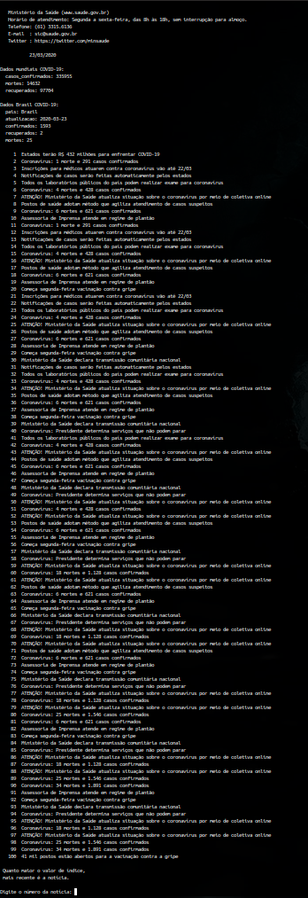

# Scripts_ShellScript_noticia_oficial_Ministerio_da_Saude
Selecionar links de fonte oficial do Ministério da Saúde.

Tem por finalidade oferecer de forma imediata notícias do site do Ministério da Saúde via ShellScript no Termianl Linux.


- Google-chrome é pré requisito. Mas pode ser alterado no script.
- Para que a API funcione, é necessário que esteja instaldo o [jq](https://stedolan.github.io/jq/). 

```
sudo apt install jq
``` 
- [API](https://coronavirus-tracker-api.herokuapp.com/v2/locations)
- Uso:

```
$ chmod +x noticia_oficial_Ministerio_da_Saude.sh
$ ./noticia_oficial_Ministerio_da_Saude.sh
```


